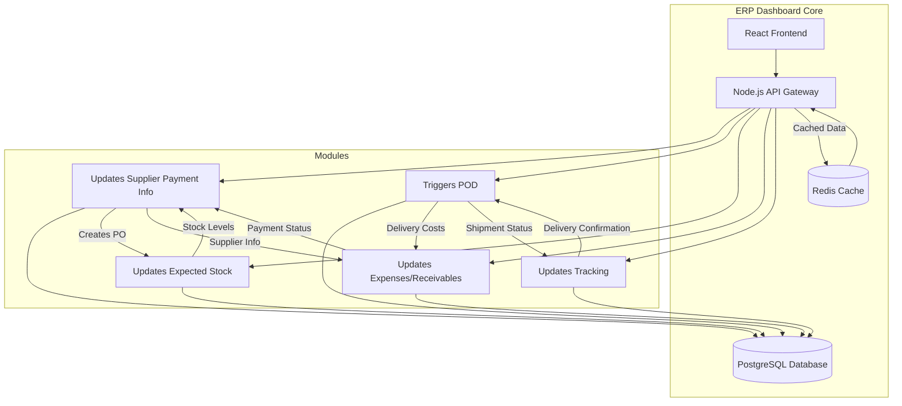
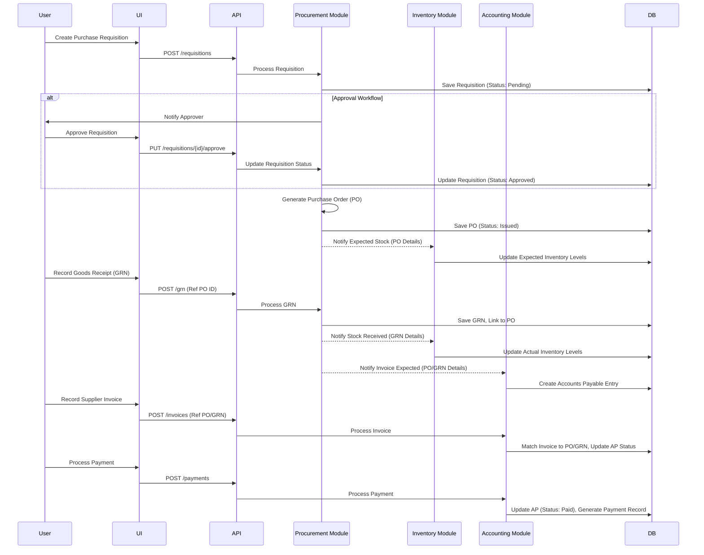
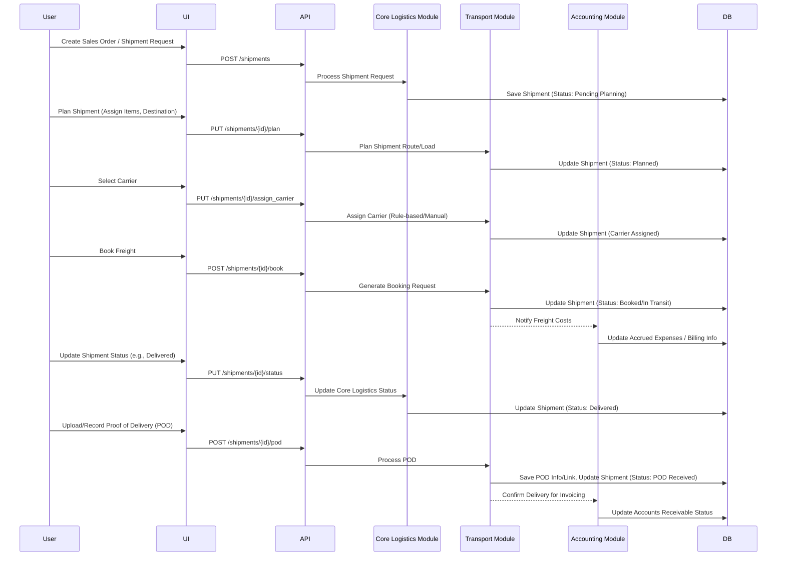

# Logistics ERP Dashboard: Architectural Plan

## 1. Introduction & Scope

This document outlines the architectural plan for integrating **Procurement** and **Transport** modules into the existing Logistics ERP Dashboard. The plan leverages the foundation laid out in the `implementation-roadmap.md` and details the specific components, interactions, technology choices, scalability, and security considerations for these new modules.

**Scope:**

*   **Procurement Module:**
    *   Purchase Requisition creation and basic approval workflow.
    *   Basic Supplier Relationship Management (SRM): Supplier onboarding and performance metric tracking.
    *   Goods Receipt Note (GRN) processing against Purchase Orders.
*   **Transport Module:**
    *   Shipment Planning: Basic load definition and route assignment.
    *   Carrier Selection: Rule-based or manual selection of carriers.
    *   Basic Freight Booking: Generating booking requests/confirmations.
    *   Proof of Delivery (POD) Management: Capturing and linking POD documents/data.

## 2. Module Interactions & Data Flows

### 2.1. Overall Module Interaction

This diagram shows how the new Procurement and Transport modules fit into the broader ERP system.

### 2.2. Procure-to-Pay (P2P) Data Flow

### 2.3. Order-to-Delivery (O2D) Data Flow (Transport Focus)

## 3. Technology Stack

We will adhere to the stack defined in the roadmap, with considerations for the new modules:

*   **Frontend:** React (using existing components where possible, creating new ones for Procurement/Transport views)
*   **Backend API:** Node.js (Express.js framework) - Develop new API endpoints under `/api/procurement` and `/api/transport`.
*   **Database:** PostgreSQL - Extend the existing `schema.sql` with tables for:
    *   `PurchaseRequisitions`, `Suppliers`, `PurchaseOrders`, `GoodsReceiptNotes`
    *   `Carriers`, `ShipmentPlans`, `FreightBookings`, `ProofOfDeliveries`
    *   Ensure appropriate foreign key relationships and indexing (as started in the roadmap).
*   **Caching:** Redis - Cache frequently accessed, relatively static data like supplier lists, carrier details, or common lookup values.
*   **Potential Addition (Scalability):** Message Queue (e.g., RabbitMQ, Kafka, or cloud-native like AWS SQS/Google PubSub) - To handle asynchronous tasks like sending notifications, processing background jobs (e.g., complex carrier selection logic), or decoupling inter-module communication, especially for high-volume events like shipment status updates if real-time external tracking is integrated later.

## 4. Key Integration Points

*   **Procurement <-> Inventory:**
    *   Procurement sends PO details to Inventory to update expected stock.
    *   Inventory sends current stock levels to Procurement to inform requisition needs.
    *   Procurement sends GRN details to Inventory to update actual stock upon receipt.
*   **Procurement <-> Accounting:**
    *   Procurement sends approved PO/GRN details to Accounting for AP creation.
    *   Accounting sends payment status updates back to Procurement (visible on Supplier records).
*   **Transport <-> Core Logistics:**
    *   Transport receives shipment requests initiated via Core Logistics (e.g., from Sales Orders).
    *   Transport sends planned shipment details, carrier assignments, and booking status back to Core Logistics.
    *   Transport sends POD confirmation back to Core Logistics.
*   **Transport <-> Accounting:**
    *   Transport sends freight cost estimates/actuals to Accounting for expense tracking or customer billing.
    *   Accounting may provide credit status checks relevant to shipment release (future enhancement).
*   **Internal APIs:** All inter-module communication happens via internal API calls orchestrated by the Node.js backend or potentially via a message queue.
*   **External APIs (Future):** Placeholder considerations for integrating with:
    *   Supplier Portals/APIs (for PO transmission, invoice submission).
    *   Carrier APIs (for booking, real-time tracking, electronic POD).

## 5. Scalability Considerations (10k+ Daily Transactions)

*   **Database:**
    *   **Indexing:** Continue identifying and creating indexes for common query patterns (e.g., filtering requisitions by status, querying shipments by date range or carrier). Use `EXPLAIN ANALYZE` as shown in the roadmap.
    *   **Connection Pooling:** Ensure the Node.js backend uses a connection pool (like `pg-pool`) to manage database connections efficiently.
    *   **Read Replicas:** For read-heavy dashboards, consider setting up PostgreSQL read replicas to distribute load.
    *   **Archiving:** Plan for archiving old transactional data (e.g., completed shipments/POs older than X years) to keep primary tables performant.
*   **Backend API:**
    *   **Stateless Design:** Ensure API endpoints are stateless to allow horizontal scaling.
    *   **Load Balancing:** Deploy multiple instances of the Node.js application behind a load balancer (e.g., Nginx, HAProxy, or cloud provider's LB).
    *   **Asynchronous Processing:** Offload long-running or non-critical tasks (notifications, complex calculations, external API calls) to background workers via a message queue. This prevents blocking API requests and improves responsiveness.
*   **Caching:** Use Redis aggressively for data that doesn't change frequently (e.g., user roles/permissions, configuration settings, carrier master data). Cache query results where appropriate.
*   **Frontend:** Optimize bundle sizes, use code splitting, and implement efficient data fetching strategies (e.g., pagination, lazy loading).

## 6. Security Architecture

Building upon the roadmap's security foundations:

*   **Authentication:** Continue using the existing authentication mechanism (presumably JWT or session-based).
*   **Authorization (RBAC):**
    *   Define specific roles (e.g., `Procurement_Manager`, `Buyer`, `Receiver`, `Transport_Planner`, `Dispatcher`, `Finance_AP`, `Finance_AR`).
    *   Implement middleware in the Node.js API to check user roles against required permissions for accessing specific endpoints or performing actions (e.g., only `Procurement_Manager` can approve requisitions above $X).
    *   Store roles/permissions in the database, potentially cached in Redis for performance.
*   **Data Encryption:**
    *   **At Rest:** Encrypt sensitive data in the database (e.g., supplier bank details, potentially sensitive contract terms) using PostgreSQL extensions like `pgcrypto` or transparent data encryption features if available. Continue using `encryption_key_id` as planned.
    *   **In Transit:** Ensure all communication (UI <-> API, API <-> DB, API <-> External APIs) uses TLS/SSL.
*   **API Security:**
    *   **Input Validation:** Rigorously validate all data received via API endpoints to prevent injection attacks (SQLi, XSS).
    *   **Rate Limiting:** Implement rate limiting on the API gateway to prevent abuse.
    *   **Helmet.js (or similar):** Use security middleware in Express.js to set standard security headers.
*   **Audit Trail:** Extend the `AuditLog` table (from the roadmap) to capture actions within the Procurement and Transport modules (e.g., `PO_Created`, `Shipment_Booked`, `GRN_Received`, `POD_Uploaded`). Ensure `user_id` and `action_timestamp` are logged accurately.
*   **Dependency Scanning:** Regularly scan project dependencies (both frontend and backend) for known vulnerabilities.

---