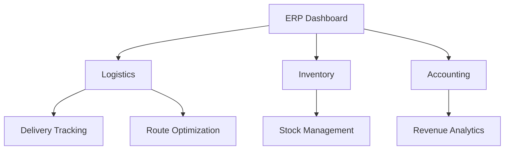
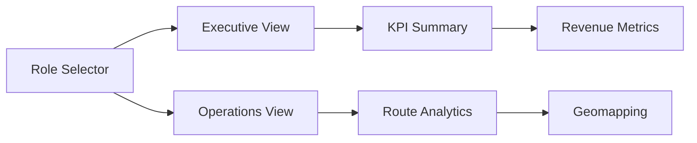
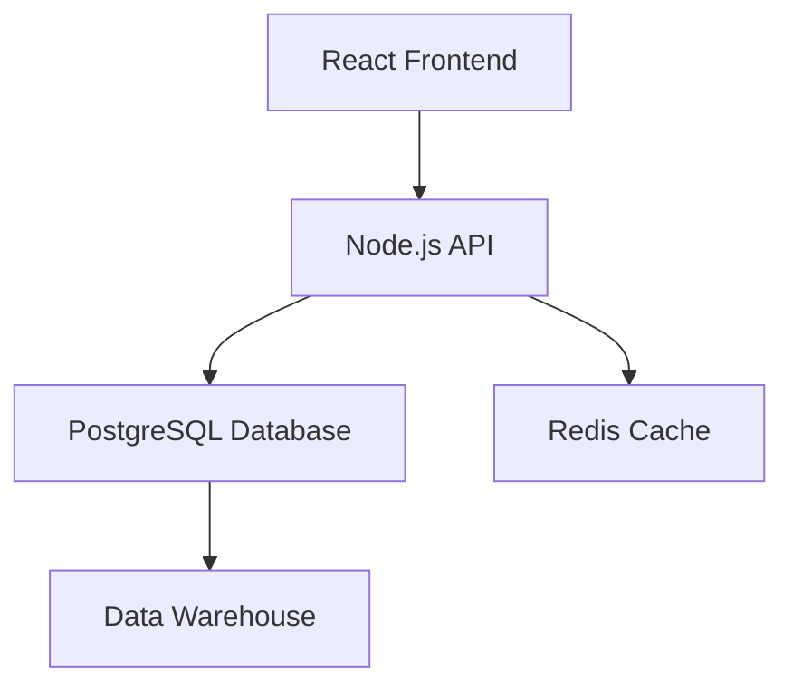

# ERP Dashboard Implementation Roadmap

## 1. Data Analysis & Modeling
### Schema Validation
```sql
-- Primary Key Verification
SELECT COUNT(DISTINCT DeliveryID) = COUNT(*) FROM FreightDeliveryStats;

-- State Constraints Check
SELECT DISTINCT OriginState, DestinationState FROM FreightDeliveryStats;
```

### Core Module Integration


### SQL Optimizations
```sql
CREATE INDEX idx_delivery_date ON FreightDeliveryStats(DeliveryDate);
CREATE INDEX idx_route_origin_dest ON FreightDeliveryStats(OriginState, DestinationState);
```

## 2. UI/UX Specifications
### Dashboard Components


## 3. Technical Architecture
### System Stack


## 4. Security Implementation
### GDPR Compliance
```sql
ALTER TABLE FreightDeliveryStats
ADD COLUMN data_owner VARCHAR(255),
ADD COLUMN encryption_key_id UUID;

CREATE TABLE AuditLog (
    log_id SERIAL PRIMARY KEY,
    action_timestamp TIMESTAMP,
    user_id VARCHAR(255),
    action_type VARCHAR(50),
    affected_table VARCHAR(255)
);
```

## 5. Performance Strategy
### Query Optimization
```sql
EXPLAIN ANALYZE
SELECT OriginState, COUNT(*) 
FROM FreightDeliveryStats
WHERE DeliveryDate BETWEEN '2024-01-01' AND '2024-03-31'
GROUP BY OriginState;
```

## 6. Testing & Deployment
### A/B Test Setup
```sql
CREATE TABLE UIVariants (
    variant_id SERIAL PRIMARY KEY,
    component_name VARCHAR(255),
    variant_a_metrics JSONB,
    variant_b_metrics JSONB
);

-- Phased Rollout Schedule
Q2 2025: Core Logistics Module
Q3 2025: Accounting Integration
Q4 2025: Full Feature Release